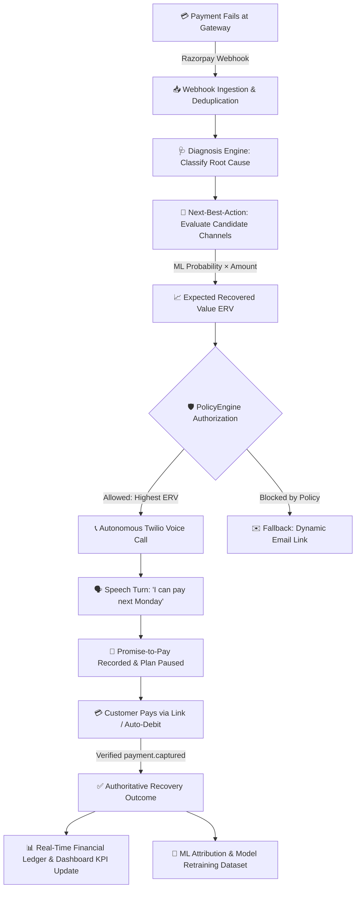

# 🛡️ RevenueShield AI — Autonomous Revenue Recovery Platform

<p align="center">
  
</p>

<p align="center">
  <a href="#-quickstart-guide"></a>
  <a href="#-quickstart-guide"></a>
  <a href="#-quickstart-guide"></a>
  <a href="#-key-features"></a>
  <a href="#-key-features"></a>
  <a href="#-test-suite-status"></a>
</p>

---

## 🌟 What is RevenueShield?

**RevenueShield** is an enterprise-grade **Autonomous Revenue Recovery & Intelligent Dunning Platform**. It automatically rescues failed subscription billing and invoice payments by combining **conversational Voice AI**, **predictive Next-Best-Action machine learning**, and **authoritative payment ledger reconciliation**.

Instead of sending passive emails that get lost in spam, RevenueShield diagnoses the exact cause of payment failure, recommends the highest-value outreach channel, engages customers through intelligent phone calls to record **Promise-to-Pay (PTP)** commitments, and reconciles recovered revenue in real-time.

---

## 🚀 Key Features

| Feature | Description |
| :--- | :--- |
| 📞 **Twilio Voice AI Agent** | Outbound conversational voice agent with **Amazon Polly TTS** and speech recognition (`<Gather input="speech">`) that speaks with customers, negotiates payment dates, and captures Promise-to-Pay agreements. |
| 🧠 **Predictive Next-Best-Action (NBA)** | Evaluates candidate interventions (`VOICE`, `EMAIL`, `PAYMENT_RETRY`, `WHATSAPP`) calculating **Expected Recovered Value** ($\text{ERV} = P(\text{recovery}) \times \text{Amount}$). |
| 🛡️ **Policy & Compliance Guard** | Independent deterministic engine enforcing quiet hours (`20:00 - 08:00`), 3-attempt caps, cooldown periods, and instant outreach pausing on active PTP commitments. |
| 💳 **Razorpay Payment Gateway** | Real-time webhook ingestion with **HMAC-SHA256 signature verification**, automated smart retry execution, and secure payment link generation. |
| 📊 **Command Center Dashboard** | Live fintech operations dashboard featuring real-time revenue KPIs, interactive case timeline, PTP tracking modal, and recovery trend charts. |
| 🔁 **Self-Learning Retraining Loop** | Point-in-time feature extraction with a 72-hour attribution window, anti-data-leakage auditing, and automated versioned model serialization (`.joblib`). |

---

## 🔄 End-to-End Recovery Flow



---

## 💻 Visual Command Center Dashboard

The built-in web portal provides instant visibility into your revenue pipeline:
- **Total Revenue at Risk vs. Recovered**: Calculated strictly from verified payment gateway captures.
- **Recovery Rate KPI**: Live statistical efficiency across all failure categories.
- **Interactive Case Timeline**: Full chronological audit trail (`PAYMENT_FAILED` $\to$ `DIAGNOSIS` $\to$ `VOICE_CALL` $\to$ `PROMISE_TO_PAY` $\to$ `RECOVERED`).
- **Promise-to-Pay Manager**: Monitor outstanding commitments and automated pause statuses.

---

## ⚡ Quickstart Guide

### 1. Prerequisites
- **Python 3.12+**
- **PostgreSQL 16+** (or SQLite for local sandbox testing)
- **Twilio Account** *(Optional for live voice testing)*
- **Razorpay Account** *(Optional for live payment testing)*

### 2. Clone & Virtual Environment Setup
```bash
# Clone the repository
git clone https://github.com/your-username/RevenueShield.git
cd RevenueShield

# Create and activate Python virtual environment
python -m venv .venv
# On Windows:
.venv\Scripts\activate
# On Linux/macOS:
source .venv/bin/activate

# Install dependencies
pip install -r backend/requirements.txt
```

### 3. Configure Environment Variables
```bash
# Copy example environment configuration
cp backend/.env.example backend/.env
```
Edit `backend/.env` with your gateway credentials or run in `EXECUTION_MODE=dry_run` for complete offline simulation.

### 4. Run Database Migrations
```bash
cd backend
alembic upgrade head
```

### 5. Launch the Platform
```bash
uvicorn app.main:app --host 0.0.0.0 --port 8000 --reload
```

### 6. Open the Command Center
Open your browser and navigate to:
👉 **`http://localhost:8000/portal`**

Interactive API Documentation:
👉 **`http://localhost:8000/docs`**

---

## 🔌 API & Webhook Reference

| Endpoint | Method | Purpose |
| :--- | :---: | :--- |
| `GET /health` | `GET` | Service liveness probe returning `{"status": "ok"}` |
| `GET /health/ready` | `GET` | Readiness probe validating PostgreSQL connection and ML model status |
| `GET /dashboard/summary` | `GET` | Command Center summary metrics (Revenue at Risk, Recovered, Rate) |
| `GET /dashboard/timeline/{case_id}` | `GET` | Complete chronological audit ledger for a specific case |
| `POST /webhooks/razorpay` | `POST` | Razorpay webhook receiver with HMAC-SHA256 signature verification |
| `POST /webhooks/twilio/voice/{call_id}/gather` | `POST` | Twilio Speech Recognition callback returning interactive TwiML |
| `POST /webhooks/twilio/voice/{call_id}/status` | `POST` | Twilio status callback tracking call completion and duration |

---

## 🧪 Test Suite Status

RevenueShield includes a comprehensive automated test suite covering unit tests, decision policies, ML pipelines, voice state machines, and complete end-to-end integration workflows:

```bash
pytest -q
======================= 316 passed, 249 warnings in 35.67s =======================
```

**100% Passing Rate across 316 Test Scenarios.**

---

## 🔒 Security & Privacy

- **Zero-Secret Logging**: Private gateway tokens and passwords are scrubbed from all system logs.
- **HMAC Signature Verification**: All webhook payloads are cryptographically validated before ingestion.
- **Role-Based Guards**: Test calling endpoints are protected behind `X-Internal-Secret` in production.
- **Strict CORS Protection**: Configurable explicit origin whitelists prevent unauthorized cross-origin requests.

---

## 📄 License

This project is licensed under the **MIT License** — see the [LICENSE](LICENSE) file for details.
